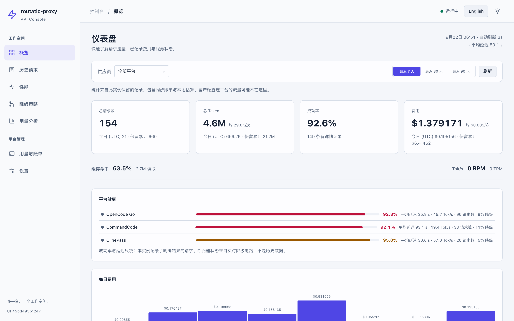
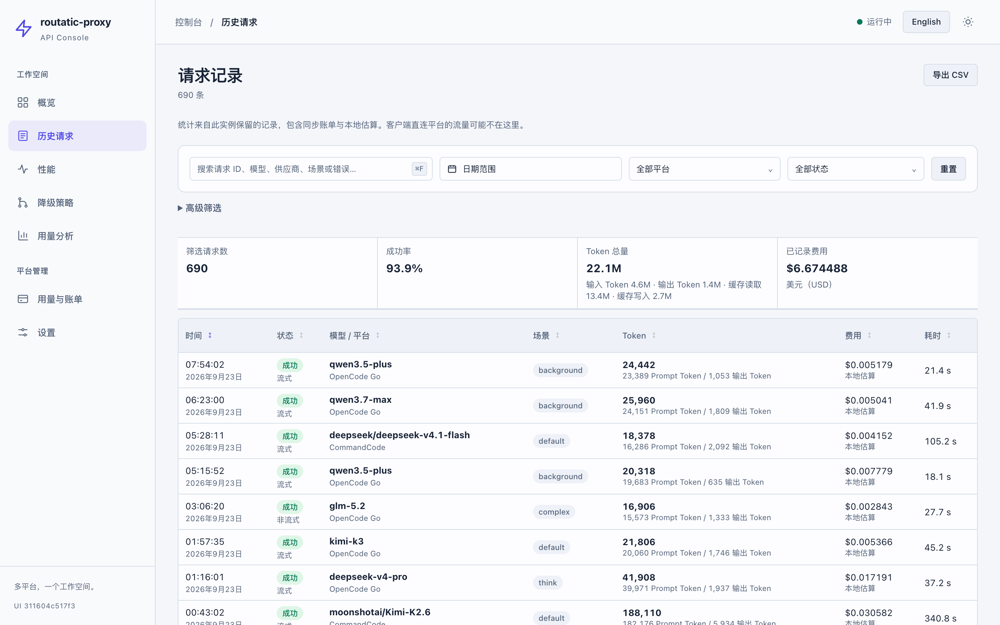
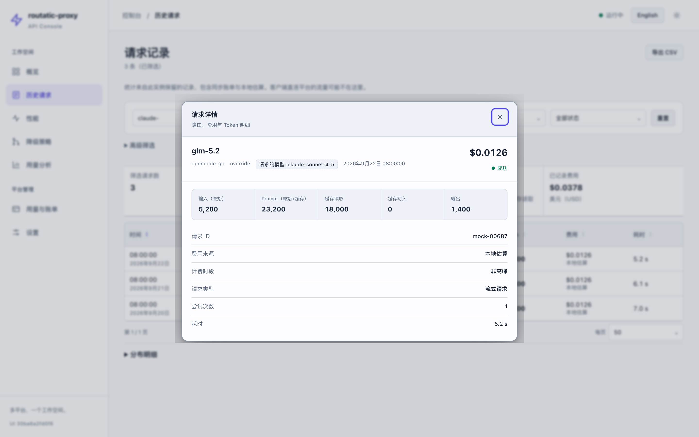
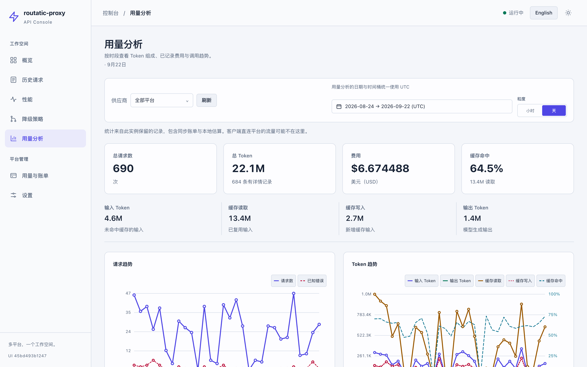
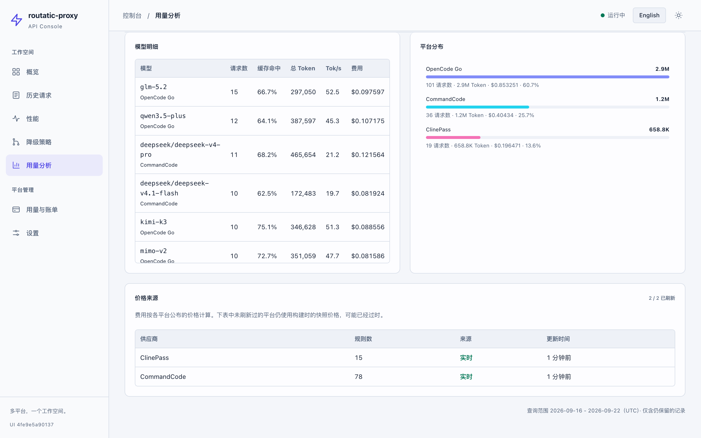
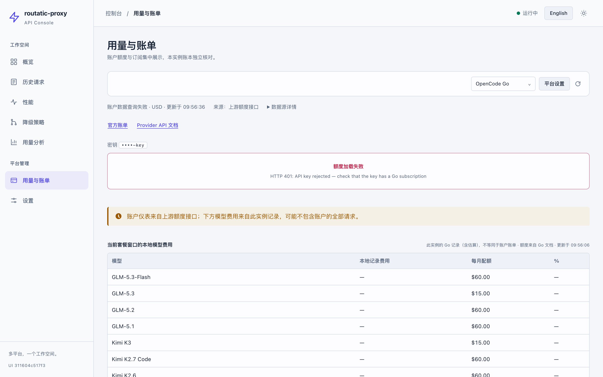
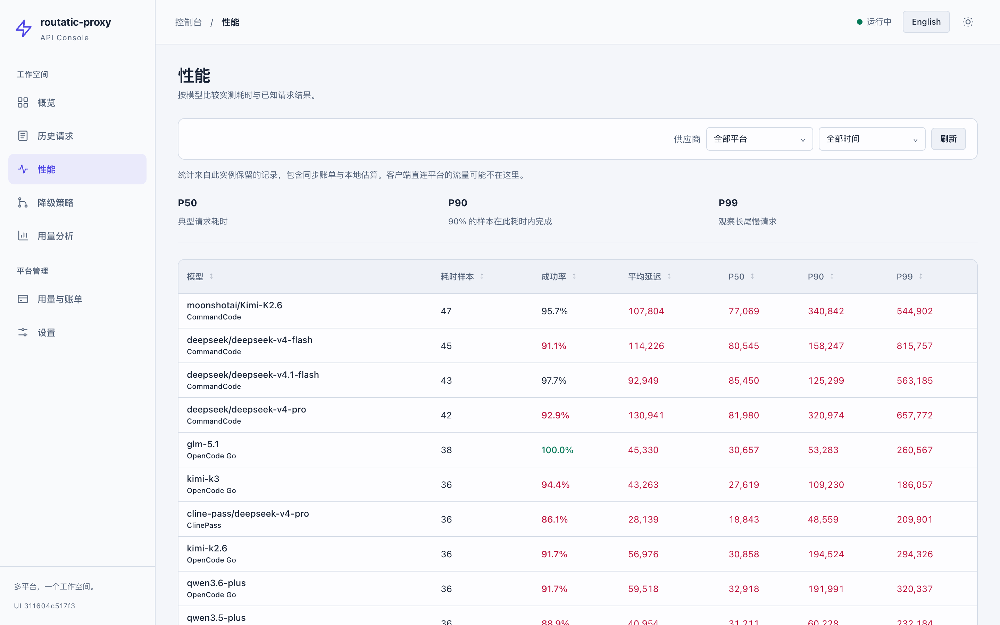
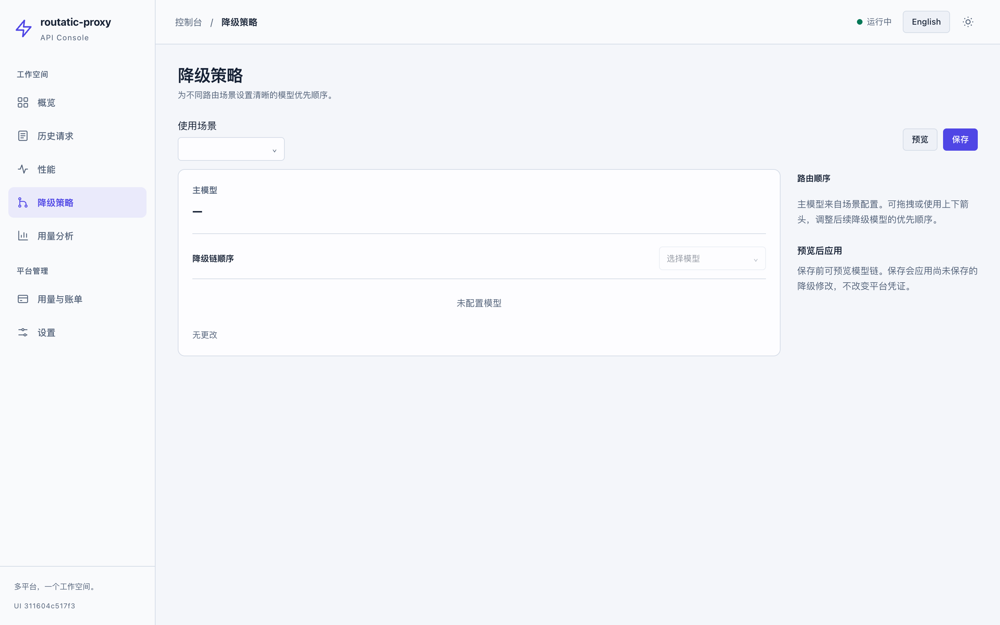
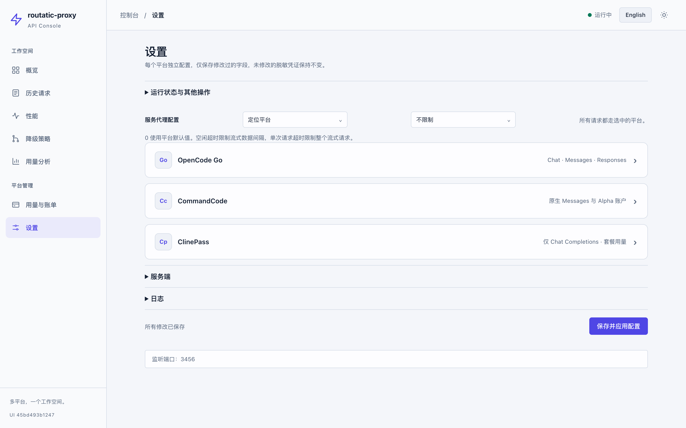

# routatic-proxy [加入 Discord](https://discord.gg/pUrfwfTFxM)

[](https://go.dev/)
[](./LICENSE)

[English](./README.md) | **中文**

一个 Go CLI 代理，将 [Claude Code](https://code.claude.com/docs/en/llm-gateway-connect) Messages 和 [Codex](https://developers.openai.com/codex/config-advanced) Responses 请求路由到 OpenCode Go、OpenCode Zen、AWS Bedrock、OpenRouter 和 CommandCode，提供模型路由、日志和用量统计。

上游支持原生 Anthropic 时直接转发；其他链路按配置转换协议。Codex 入口支持有明确边界的无状态 Responses 子集，配置方式与限制见 [CommandCode 接入指南](docs/commandcode.md)。

---

## macOS GUI 版本

本仓库为 `routatic-proxy` 额外提供了 macOS 原生图形界面支持（系统托盘 + 内嵌控制台面板）。

### 功能特点

- **系统托盘图标** — 直接在 macOS 顶部状态栏中快捷控制代理服务的启动、停止、开机自启和退出。
- **交互式控制台** — 原生窗口控制台，支持查看实时历史请求、模型调用分布，并且无需手动编辑 JSON 配置文件，即可直接在界面中修改和保存 API Key。
- **DMG 一键安装包** — 提供标准的 macOS 应用程序打包，带有关机自启与双击运行托盘支持。

### 如何运行

您可以直接在此仓库的 **Releases** 页面下载编译好的 `.dmg` 安装包，或者在终端运行以下命令启动：

```bash
# 启动代理和浏览器面板
routatic-proxy start
# 后台运行
routatic-proxy start -b
```

浏览器访问 `http://127.0.0.1:3445`。Web 面板不依赖 CGO；原生托盘仅在 macOS + CGO 构建中提供。仅需要代理时使用 `serve`。

### 控制台预览

**仪表盘标签页：** 概览、历史请求、性能、降级策略、用量分析、用量与账单、设置。

概览、历史、性能和用量分析均可独立筛选平台；趋势、模型明细、汇总和比较使用相同平台范围。历史 CSV 导出固定开始时的筛选条件，不受分页期间切换平台影响。

**概览** 给出请求、Token、成功率与费用，并在每张统计卡主值下附带可读的速率（`均 71.5K/次`、`12/分`）。平台健康表按平台给出成功率、平均延迟、实测吞吐与降级占比，断路状态以圆点标注。每日费用以柱状图呈现：区间内只有一天时收窄为单柱并在说明中点出该日金额，日期标签按可用宽度自动稀疏，避免重叠。

**历史请求** 支持按平台、状态、时间、模型、使用场景、请求类型和费用来源筛选，并按任意列排序。Token 列第一行是总数，第二行是提示 / 输出的拆分，不打开弹窗即可看出单次请求的形态。被路由到其他模型时，详情弹窗在服务模型下方标出客户端**请求的模型**，并给出该次请求自身的 Tok/s——与模型明细表同口径，因此一行的数可以与其模型均值对照。命中 deepseek 工作日高峰时段（UTC 01-04 / 06-10，即北京 09:00-12:00 / 14:00-18:00）的记录带 `高峰 ×2` 角标，费用按 ×2 计算。峰谷适用于各平台自己发布了两档费率的 DeepSeek 模型，三家平台的窗口一致。中国法定节假日按规则排除：OpenCode Go 与 ClinePass 沿用 DeepSeek 的表述，CommandCode 自己写明规则且无此豁免、节假日照计高峰。日历取自国务院公告（每日抓取），并内嵌一份种子到二进制里，因此节假日按低谷计费而不是高峰。日志可通过搜索框按请求模型、服务模型、供应商、场景和错误信息检索。

**用量分析** 提供 KPI、按周期与按模型的明细表、Token 趋势和平台分布。模型明细表含每模型实测吞吐（Tok/s，为输出 Token 除以整个请求耗时，因此含等待首 token 的时间；无可测量样本时留空而非显示 0）。可自定义起止日期（最长 92 天，支持小时粒度）。模型分布只列前 5 名并在标题标出 `前 5 / 19`，平台分布则全部列出——平台是固定短集合，隐藏一个就等于谎报流量去向。

**价格来源** 面板说明每个平台的价格表来自实时抓取还是构建时快照，以及最近一次抓取时间。两者算出的费用在界面上完全一致，因此必须显式区分：本项目自身就遇到过内置快照数周内失效的情况（OpenCode Go 调整了 DeepSeek 价格、CommandCode 重新定价了四个模型），期间面板一直用已作废的费率显示着格式工整的数字。

**用量与账单** 为各平台分别展示本实例的请求、Token、费用已知小计和缺价记录。账户数据另行查询：OpenCode Go 保留三个限额窗口（5 小时滚动 / 本周 / 本月）；OpenRouter 查询每个推理 Key 的额度与 UTC 用量，并使用独立的 `openrouter.management_api_key` 查询账户 Credits，BYOK 用量单独显示。CommandCode 使用自己的 Key 查询官方 Alpha 点数、订阅与用量汇总，无需浏览器 Cookie。ClinePass 使用自己的 Key 读取套餐窗口，按参考价折算为百分比而非应付金额。密钥仅以掩码展示；上述账户结果按平台缓存 30 秒。

AWS Bedrock 已接入 [Cost Explorer 独立账单查询](docs/aws-bedrock-billing.md)：默认关闭，需显式账户 ID 和服务进程的独立 AWS SDK 身份；仅手动按钮发起收费查询，普通刷新只读取同账户、同 UTC 日的缓存。展示最近 30 个完整 UTC 日内已列明服务的费用、币种与预估标记，不当作剩余额度。

Go 模型额度来自 [Go 文档](https://opencode.ai/docs/zh-cn/go)，分模型用量是本实例估算，不是官方账户账单；仅在配置单个 Go 密钥且月度窗口已知时展示，多密钥无法从本地记录可靠归属到账户。Go 用量端点与 CommandCode Alpha 端点尚非稳定公开合同；Zen 仍未取得账户查询合同。CommandCode 点数不是现金，接口未返回月度总额时不推算月百分比。详情见[五平台能力矩阵](docs/platform-integration-review.md#五平台页面与账户能力)。

未知价格显示 `—`，部分已知费用明确标注“已知”小计与未知记录数，不当作免费。用量分析的日期/时间桶和概览“今日”边界使用 UTC；历史日期筛选和单条时间使用浏览器本地时区。设置按平台折叠定位，排序和降级链调整支持键盘，并保留浅深主题及手机布局。

以下截图使用固定的合成演示数据，不包含生产请求、账户数据或凭证。可用 `python3 scripts/make-mock-data.py` 重新生成同数据集并复现这些截图。

#### 概览



#### 历史请求



#### 请求详情



#### 用量分析



#### 价格来源



<details>
<summary>用量与账单、性能、降级策略和设置</summary>









</details>

---

## 为什么选择 routatic-proxy？

多个平台可以共用客户端入口、路由和本地观测。平台凭证分别配置；实际模型权限、套餐与费用以相应平台为准，原生支持和协议适配不代表客户端的所有高级功能都可用。

## 功能特性

- **多提供商支持** — 从单一配置路由到 OpenCode Go、OpenCode Zen、AWS Bedrock、OpenRouter 或 CommandCode
- **透明代理** — Claude Code 发送 Anthropic 格式请求，代理转换为目标提供商格式并返回
- **模型路由** — 根据上下文自动路由到不同模型（默认、思考、长上下文、后台）
- **流式场景路由** — 可配置的流式请求路由；为 Claude Code 多代理和审查工作流启用正确的场景选择
- **降级链** — 如果模型失败，自动尝试降级链中的下一个
- **熔断器** — 跟踪模型健康状况，跳过故障模型以避免延迟峰值
- **实时流式** — 完整的 SSE 流式传输，实时格式转换
- **工具调用** — 正确的 Anthropic tool_use/tool_result <-> OpenAI/Gemini 函数调用转换
- **Token 计数** — 使用 tiktoken (cl100k_base) 进行准确的 token 计数和上下文阈值检测
- **JSON 配置** — 灵活的配置文件，支持环境变量覆盖和 `${VAR}` 插值
- **热重载** — 监视配置文件变化并自动重新加载（默认关闭）
- **后台模式** — 作为守护进程运行，与终端分离
- **登录自启动** — 通过 launchd 在系统启动时启动（macOS）
- **自更新** — 一键检查并安装最新版本

## 支持的模型

### OpenCode Go 模型

| 模型 | 上下文 | 最佳用途 |
|------|--------|----------|
| **GLM-5.2** | ~200K tokens | 关键架构决策、生产代码审查 |
| **Kimi K2.7 Code** | ~256K tokens | 大型代码生成，32K 最大输出 |
| **Qwen3.7 Plus** | ~128K tokens | 通用编码，比 Qwen3.6 质量更好 |
| **Qwen3.7 Max** | ~128K tokens | 复杂编码，Qwen 最佳质量 |

完整模型列表（包括成本和路由建议）请参见 [MODELS.md](MODELS.md)。

### OpenCode Zen 模型

Zen 提供按使用量付费的额外模型：

- **Claude 模型**: Claude Fable 5, Claude Opus 4.8/4.6/4.5/4.1, Claude Sonnet 4
- **Gemini 模型**: Gemini 3.5 Flash, Gemini 3.1 Pro, Gemini 3 Flash
- **GPT 模型**: GPT 5.5, GPT 5.4, GPT 5.3 Codex 等
- **免费层**: DeepSeek V4 Pro, Grok Build 0.1, Big Pickle 等

完整的 Zen 模型列表请参见 [MODELS.md](MODELS.md#opencodes-zen)。

## 快速开始

### 1. 安装

```bash
# macOS / Linux
brew tap routatic/tap && brew install routatic-proxy

# Windows
scoop bucket add routatic https://github.com/routatic/scoop-bucket && scoop install routatic-proxy

# Docker（使用 Makefile）
cp .env.example .env                    # 然后在 .env 中填入你的 API key
make docker-up

# Docker（手动）
cp .env.example .env
docker build -t routatic-proxy .
docker run -d --restart unless-stopped --name routatic-proxy --env-file .env -p 3456:3456 routatic-proxy

# Docker 从 GitHub Container Registry
docker pull ghcr.io/routatic/proxy:latest
docker run -d --restart unless-stopped --name routatic-proxy --env-file .env -p 3456:3456 ghcr.io/routatic/proxy:latest
```

更多安装选项请参见 [docs/zh/INSTALLATION.md](docs/zh/INSTALLATION.md)。

### 2. 初始化配置

```bash
routatic-proxy init
```

在 `~/.config/routatic-proxy/config.json` 创建默认配置。编辑它以添加你的 API key，或设置环境变量：

```bash
export ROUTATIC_PROXY_API_KEY=sk-opencode-your-key-here
```

CommandCode 新配置可使用 `routatic-proxy init --provider commandcode`；已有配置请在设置页增加独立平台字段与模型映射，`init` 不会覆盖现有文件。完整步骤与 Codex 配置见 [接入指南](docs/commandcode.md)。

### 3. 启动代理

```bash
routatic-proxy serve
```

停止 Docker 容器（如果使用 Docker）：

```bash
make docker-stop
```

### 4. 配置 Claude Code

```bash
export ANTHROPIC_BASE_URL=http://127.0.0.1:3456
export ANTHROPIC_AUTH_TOKEN=unused
```

### 5. 运行 Claude Code

```bash
claude
```

## CLI 命令

```
routatic-proxy serve              启动代理服务器
routatic-proxy start              启动代理和面板（http://127.0.0.1:3445）
routatic-proxy start -b           后台启动代理和面板
routatic-proxy serve -b           后台启动（与终端分离）
routatic-proxy serve --port 8080  在自定义端口启动
routatic-proxy stop               停止运行中的代理服务器
routatic-proxy status             检查代理是否运行
routatic-proxy init               创建默认配置文件
routatic-proxy validate           验证配置文件
routatic-proxy models             列出模型目录中的模型
routatic-proxy autostart enable   启用登录自启动
routatic-proxy autostart disable  禁用登录自启动
routatic-proxy autostart status   检查自启动状态
routatic-proxy update             更新到最新版本
routatic-proxy update --check     检查是否有可用更新
routatic-proxy update --yes       静默更新，无需确认
routatic-proxy --version          显示版本
```

## 文档

| 文档 | 描述 |
|------|------|
| [docs/zh/INSTALLATION.md](docs/zh/INSTALLATION.md) | 安装指南 - Homebrew、Scoop、从源码构建、发布二进制 |
| [docs/zh/CONFIGURATION.md](docs/zh/CONFIGURATION.md) | 配置指南 - 配置文件参考、环境变量、模型路由、降级链 |
| [docs/commandcode.md](docs/commandcode.md) | CommandCode 独立配置、Claude Code/Codex 接入与兼容边界 |
| [docs/platform-integration-review.md](docs/platform-integration-review.md) | 功能修复、上游采纳记录与验证范围 |
| [docs/zh/MODELS.md](docs/zh/MODELS.md) | 模型指南 - 模型能力、成本和路由建议 |
| [CONTRIBUTING.md](CONTRIBUTING.md) | 贡献指南 - 开发环境、架构概览和如何提交 PR |
| [docs/zh/TROUBLESHOOTING.md](docs/zh/TROUBLESHOOTING.md) | 故障排除 - 常见问题和调试模式 |
| [docs/architecture.md](docs/architecture.md) | 系统设计 - 请求流程、模块概览 |
| [docs/reference-api.md](docs/reference-api.md) | HTTP API 参考（端点、流式、错误处理） |
| [docs/howto-add-model.md](docs/howto-add-model.md) | 添加模型 - 零代码变更 |
| [docs/howto-custom-routing.md](docs/howto-custom-routing.md) | 自定义路由 - 场景检测和模型选择 |
| [docs/howto-debug-routing.md](docs/howto-debug-routing.md) | 路由调试 - 常见问题和排查方法 |

## 贡献

欢迎贡献！请参阅 [CONTRIBUTING.md](CONTRIBUTING.md) 了解开发环境设置、架构概览以及如何提交 pull request。

## 致谢

- 套餐额度窗口的解析逻辑移植自 [ocusage](https://github.com/muzimu217/ocusage)（MIT）—— 该项目梳理了 OpenCode Go 未公开用量端点及其在真实环境中的多种响应形态。

## 许可证

[AGPL-3.0](LICENSE)
