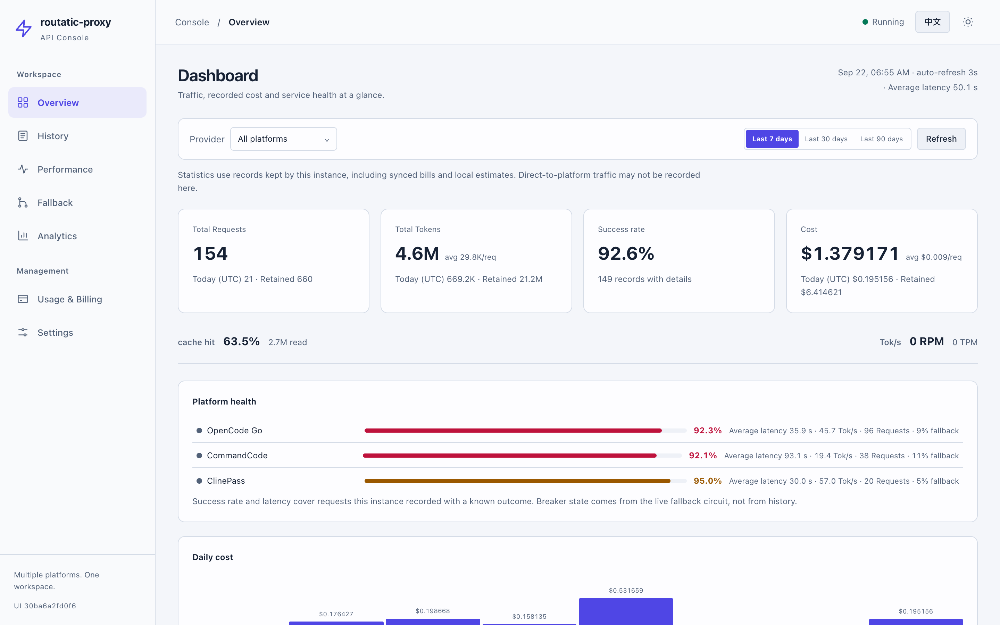
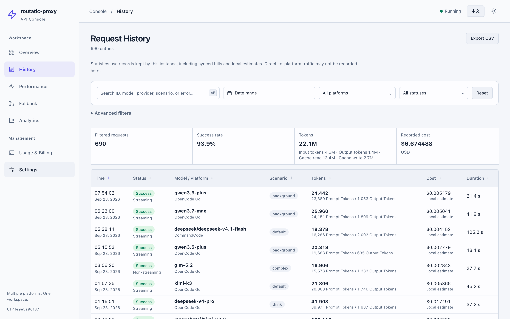
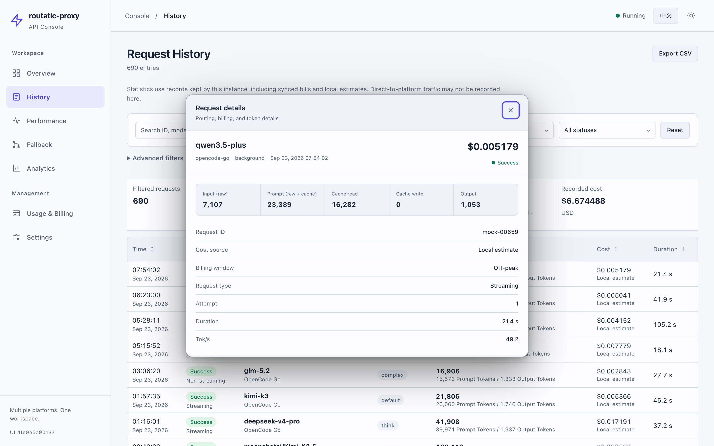
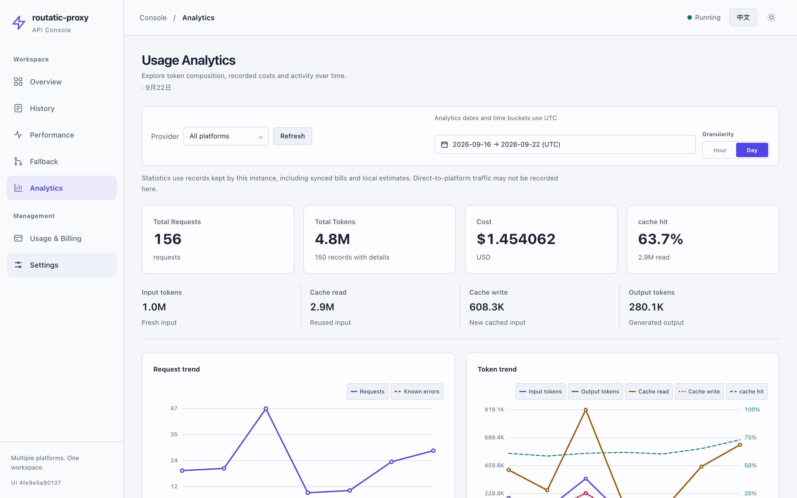
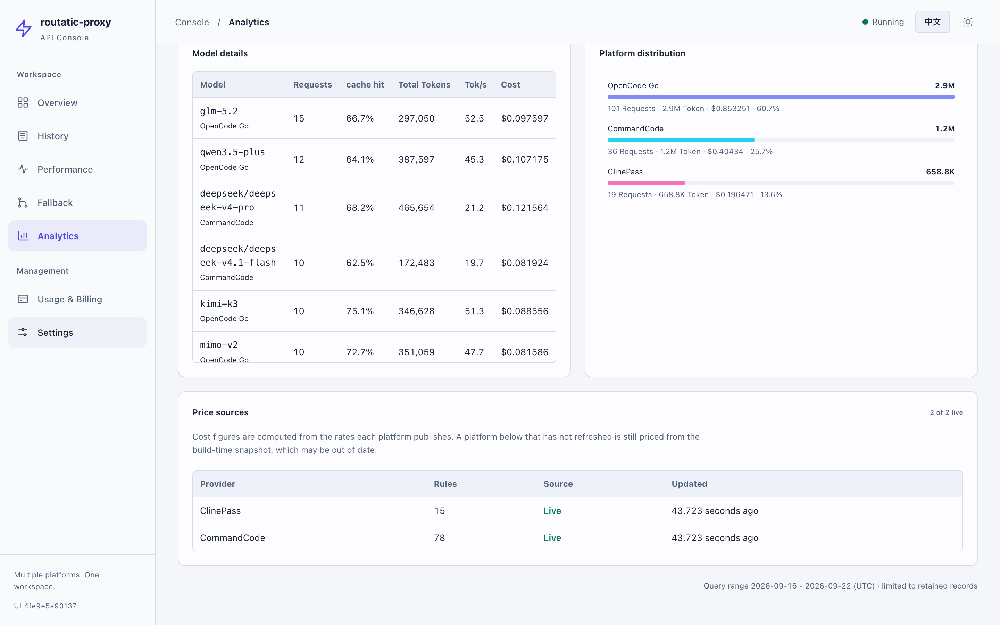
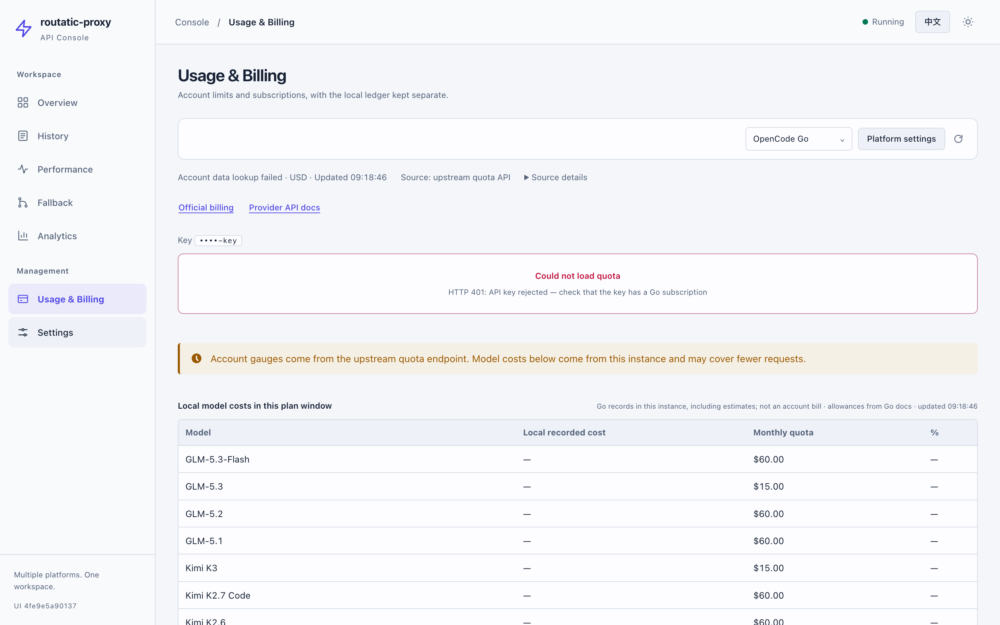
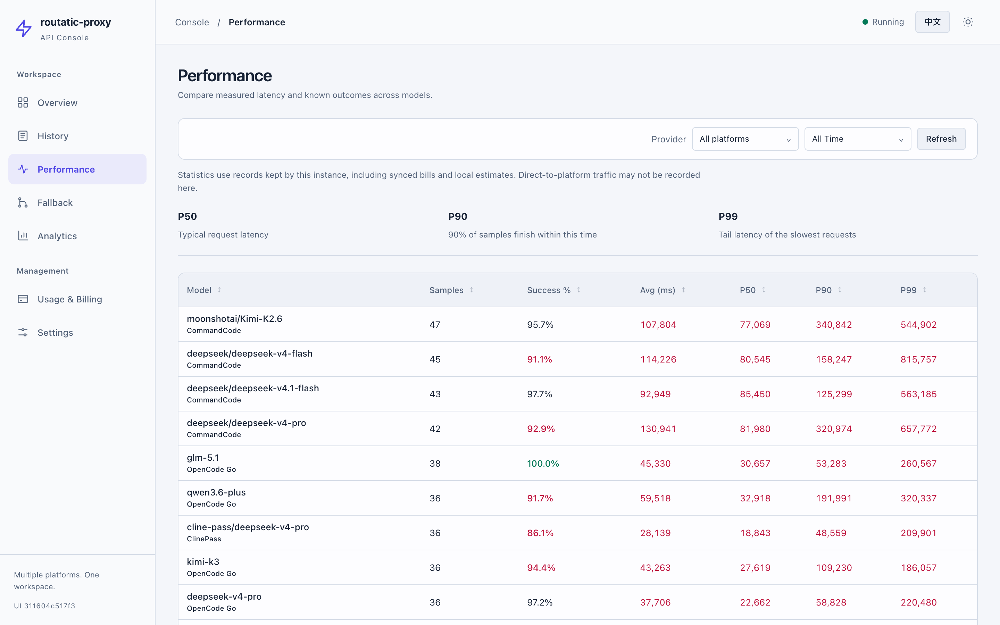
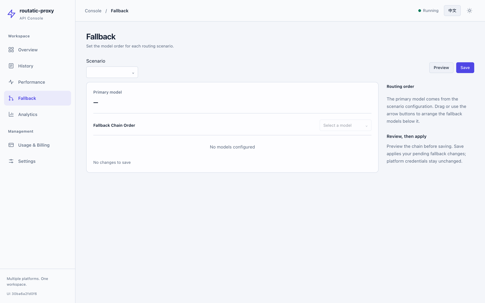
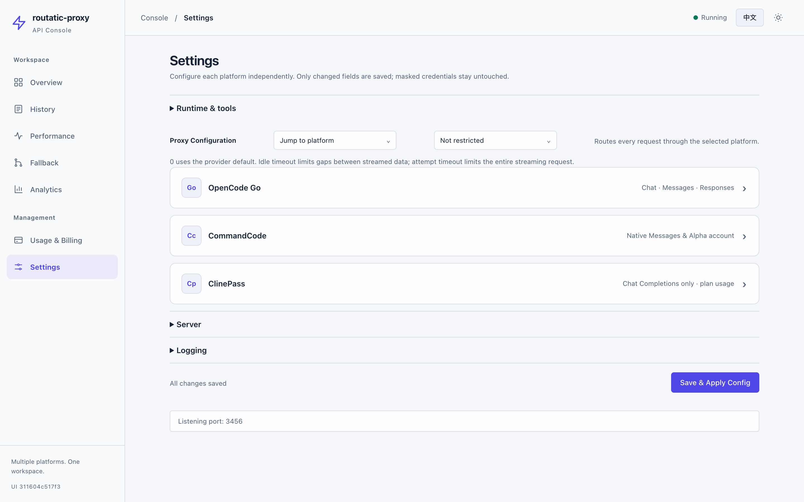

# routatic-proxy

[](https://go.dev/)
[](./LICENSE)

[Join us on Discord](https://discord.gg/pUrfwfTFxM)

**[English](./README.md)** | [中文](./README-zh.md)

## Supported Providers

<div align="center">

[](https://opencode.ai/docs/go/)
[](https://opencode.ai/docs/zen/)
[](https://aws.amazon.com/bedrock/)
[](https://openrouter.ai/)
[](https://commandcode.ai/docs/provider)
[](https://www.anthropic.com/)

</div>

| Provider | Description | Best For |
|----------|-------------|----------|
| **OpenCode Go** | High-performance open-source coding models with flat-rate pricing | Daily coding, complex reasoning, cost-effective workloads |
| **OpenCode Zen** | Curated, tested models with pay-as-you-go pricing | Claude/GPT/Gemini access without multiple API keys |
| **AWS Bedrock** | Enterprise-grade models on your own AWS infrastructure | Enterprises needing data sovereignty and compliance |
| **OpenRouter** | Unified API for 100+ LLMs with automatic failover | Experimenting with models from multiple providers |
| **CommandCode** | Official Provider API with independent credentials | Native Claude Messages and a stateless Codex Responses adapter |
| **Anthropic** | Native Claude models with anthropic-first failover mode | Claude-first workflows with OpenCode fallback |

---

A Go CLI proxy that routes [Claude Code](https://code.claude.com/docs/en/llm-gateway-connect) Messages and [Codex](https://developers.openai.com/codex/config-advanced) Responses requests through configured upstream providers.

`routatic-proxy` uses native Anthropic forwarding where supported, and otherwise converts to the configured upstream format (OpenAI Chat Completions, Anthropic Messages, Responses, or Gemini). The Codex endpoint supports an explicitly bounded stateless Responses subset; see [CommandCode and client setup](docs/commandcode.md) for configuration and limitations.

`oc-go-cc` remains available as a compatibility alias, and existing `OC_GO_CC_*` environment variables and `~/.config/oc-go-cc/config.json` files are still recognized.

---

## Why?

OpenCode Go gives you access to powerful open coding models for **$5/month** (then $10/month). OpenCode Zen provides curated, tested models with pay-as-you-go pricing. AWS Bedrock lets you run models on your own AWS infrastructure. OpenRouter gives you unified access to 100+ models. This proxy makes all of them work seamlessly with Claude Code's interface — no patches, no forks, just set two environment variables and go.

## Features

- **Multi-Provider** — Route through OpenCode Go, OpenCode Zen, AWS Bedrock, OpenRouter, or CommandCode from a single config
- **Client Protocols** — Claude Code Messages and stateless Codex Responses, with shared routing, request logs, and usage accounting
- **Model Routing** — Automatically routes to different models based on context (default, thinking, long context, background)
- **Streaming Scenario Routing** — Configurable routing for streaming requests (see [CONFIGURATION.md](CONFIGURATION.md#streaming-scenario-routing))
- **Fallback Chains** — If a model fails, automatically tries the next one in your configured chain
- **Anthropic-First Failover** — Keep Claude on Anthropic and use OpenCode only during rate limits or outages
- **Circuit Breaker** — Tracks model health and skips failing models to avoid latency spikes
- **Real-time Streaming** — Full SSE streaming with live format transformation
- **Tool Calling** — Proper Anthropic tool_use/tool_result ↔ OpenAI/Gemini function calling translation
- **Hot Reload** — Watch config file for changes and reload automatically
- **Self-Update** — Check and install the latest release with one command

See [docs/architecture.md](docs/architecture.md) for system design and request flow details.

## GUI Version

`routatic-proxy start` runs the proxy and the browser dashboard at `http://127.0.0.1:3445`. The browser dashboard does not require CGO. Native tray integration is available only on macOS builds with CGO; it is distinct from the web dashboard.

**Dashboard tabs:** Overview, History, Performance, Fallback, Usage Analytics, Usage & Billing, and Settings.

Overview, History, Performance, and Usage Analytics have independent platform filters. Totals, trends, comparisons, and model rows use the selected scope. History CSV exports retain their initial filters even if the selection changes between pages.

**Overview** reports requests, tokens, success rate and cost, and pairs each headline figure with a readable rate (`avg 71.5K/req`, `12/min`) so the number carries its own scale. A platform health table gives each platform its success rate, average latency, measured throughput and fallback share, with the circuit-breaker state as a dot. Daily cost is a column chart: a range containing a single day narrows to one column and states that day's amount in the caption, and date labels thin out automatically to the width available rather than overlapping.

**History** filters by platform, status, date range, model, scenario, request type and cost source, and sorts by any column. The Tokens column carries the total on its first line and the prompt/output split on its second, so a request's shape is readable without opening it. When a request was routed to a different model, the detail dialog names the client's **requested model** beneath the served one, and states that request's own Tok/s — the same quantity the model table reports per model, so a row can be checked against its model's average. Rows billed at a platform's peak rate carry a `Peak ×2` badge and are priced at that multiplier. Peak pricing applies to the DeepSeek models each platform publishes at two rates, on the weekday 01-04 and 06-10 UTC windows all three of them state. Chinese public holidays are excluded for the platforms whose rule says so — OpenCode Go and ClinePass inherit DeepSeek's wording, CommandCode states its own rule without the exemption and keeps billing peak — using a calendar fetched daily from the State Council notices and seeded into the binary, so a holiday is priced off-peak rather than at peak. The search box matches the requested model, the served model, provider, scenario and error text.

**Usage Analytics** provides KPIs, per-period and per-model detail tables, token trends and platform distribution. The model table carries measured throughput (Tok/s — output tokens over the whole request, so it includes the wait for the first token; left blank rather than zeroed when nothing was measured). Date ranges are selectable up to 92 days with optional hourly granularity. The model distribution lists the top 5 and marks the heading `top 5 of 19`; the platform distribution lists every platform, because platforms are a short fixed set and hiding one would misstate where traffic went.

The **Price sources** panel states whether each platform's price table came from a live fetch or the build-time snapshot, and when it was last refreshed. The two produce identical-looking cost figures, so the distinction has to be explicit: this project's own embedded snapshot went stale within weeks (OpenCode Go moved its DeepSeek rows, CommandCode repriced four models) while the dashboard showed well-formed numbers computed from retired rates.

The **Usage & Billing** tab separates each provider's local request/token/cost ledger from account data. OpenCode Go retains its 5-hour, weekly, and monthly windows. OpenRouter shows each inference key's cap and UTC usage, with BYOK usage separate; account Credits require the independent `openrouter.management_api_key`. CommandCode uses its own key to query official Alpha credits, subscriptions and usage summary, without browser cookies. ClinePass reads its plan windows with its own key and reports them as percentages of each window against reference rates, not as an amount owed. Only masked key hints reach the browser; these account results are cached per provider for 30 seconds.

AWS Bedrock has a separate [Cost Explorer billing integration](docs/aws-bedrock-billing.md), disabled by default. It requires an explicit account ID and the service's AWS SDK identity. Only the manual billing button initiates paid queries; ordinary refresh reads the same-account, same-UTC-day snapshot. Reported costs cover the listed services over 30 complete UTC days, with currency and estimate flags, not remaining credit.

Go per-model allowances come from the [Go docs](https://opencode.ai/docs/go). Per-model spend is this instance's local estimate, not an official account bill; it is shown only when one configured Go key has a known monthly window. Multiple keys cannot be attributed to accounts from the local ledger. Go's undocumented endpoint and CommandCode's Alpha endpoints may change. No public account-query contract has been verified for Zen. CommandCode credits are not cash, and its absent monthly grant is never inferred from the remaining amount. See the [capability matrix](docs/platform-integration-review.md#五平台页面与账户能力).

Unknown costs are displayed as `—`, or a labeled known subtotal with the unknown-record count, instead of being presented as free usage. Analytics date buckets and the overview's today boundary use UTC; history date filters and individual timestamps use browser-local time. Settings are grouped by platform; sorting and fallback reordering support keyboard controls, with light/dark and mobile layouts.

```bash
routatic-proxy start
# Or start in the background:
routatic-proxy start -b
```

Open `http://127.0.0.1:3445` in your browser. Use `serve` for proxy-only operation.

### Dashboard Preview

The screenshots below use fixed synthetic demonstration data. They do not contain production requests, account data, or credentials. Regenerate the same dataset with `python3 scripts/make-mock-data.py`.

#### Overview



#### Request History



#### Request Detail



#### Usage Analytics



#### Price Sources



<details>
<summary>Usage &amp; billing, performance, fallback, and settings</summary>









</details>

## Quick Start

```bash
# 1. Install
brew tap routatic/tap && brew install routatic-proxy

# 2. Initialize configuration
routatic-proxy init

# 3. Set your API key
export ROUTATIC_PROXY_API_KEY=sk-opencode-your-key-here

# 4. Start the proxy
routatic-proxy serve

# 5. Configure Claude Code
export ANTHROPIC_BASE_URL=http://127.0.0.1:3456
export ANTHROPIC_AUTH_TOKEN=unused

# 6. Run Claude Code
claude
```

See [INSTALLATION.md](INSTALLATION.md) for Homebrew, Scoop, Docker, and build-from-source options.

Prefer a GUI for switching providers? routatic-proxy works with [CC-Switch](https://github.com/farion1231/cc-switch) — see [Using with CC-Switch](CONFIGURATION.md#using-with-cc-switch).

For CommandCode, use `routatic-proxy init --provider commandcode` with a new config path, or add the independent platform settings to your existing configuration. See [the client setup guide](docs/commandcode.md) before configuring Codex or Claude Code; existing files are not overwritten by `init`.

## CLI Commands

```
routatic-proxy serve              Start the proxy server
routatic-proxy start              Start proxy and dashboard (http://127.0.0.1:3445)
routatic-proxy start -b           Start proxy and dashboard in the background
routatic-proxy serve -b           Start in background (detached from terminal)
routatic-proxy stop               Stop the running proxy server
routatic-proxy status             Check if the proxy is running
routatic-proxy init               Create default configuration file
routatic-proxy validate           Validate configuration file
routatic-proxy models             List all available models
routatic-proxy autostart enable   Enable auto-start on login
routatic-proxy update              Update to the latest release
routatic-proxy --version          Show version
```

## Documentation

| Document | Description |
|----------|-------------|
| [docs/openrouter.md](docs/openrouter.md) | OpenRouter provider setup and configuration |
| [docs/commandcode.md](docs/commandcode.md) | CommandCode independent config, Claude Code/Codex setup, and compatibility boundaries |
| [docs/platform-integration-review.md](docs/platform-integration-review.md) | Correctness fixes, selected upstream commits, and validation scope |
| [CONFIGURATION.md](CONFIGURATION.md) | Config file reference, env vars, model routing, fallback chains |
| [MODELS.md](MODELS.md) | Complete model capabilities, costs, and routing recommendations |
| [INSTALLATION.md](INSTALLATION.md) | Homebrew, Scoop, build from source, Docker |
| [CONTRIBUTING.md](CONTRIBUTING.md) | Development setup, architecture |
| [TROUBLESHOOTING.md](TROUBLESHOOTING.md) | Common issues and debug mode |
| [docs/architecture.md](docs/architecture.md) | System design and request flow |
| [docs/fedora-setup.md](docs/fedora-setup.md) | Fedora 44 setup (systemd, SELinux) |
| [docs/reference-api.md](docs/reference-api.md) | HTTP API reference |
| [docs/howto-add-model.md](docs/howto-add-model.md) | Adding new models (zero code changes) |
| [docs/howto-custom-routing.md](docs/howto-custom-routing.md) | Customizing scenario detection and routing |
| [docs/howto-debug-routing.md](docs/howto-debug-routing.md) | Debugging routing issues |

## Release Channels

This project uses a dual release channel system. See [RELEASE_PROCESS.md](RELEASE_PROCESS.md) for full details.

### Beta Channel (Automatic)
- **Trigger:** Every push to `main` branch
- **Version format:** `v{UPCOMING}-beta.{N}` (e.g., `v0.5.3-beta.1`), where `{N}` is a sequential counter
- **GitHub release:** Marked as prerelease
- **Use case:** Get the latest features and bug fixes immediately; ideal for testing

### Production Channel (Manual)
- **Trigger:** Manual `workflow_dispatch` on `releases` branch
- **Version format:** `vX.Y.Z` (semantic versioning)
- **GitHub release:** Marked as stable
- **Docker tags:** `vX.Y.Z`, `vX.Y`, `vX`, `latest`
- **Use case:** Stable, tested releases for production use

## Contributing

We welcome contributions! Please see [CONTRIBUTING.md](CONTRIBUTING.md) for development setup, architecture overview, and how to submit pull requests.

## Acknowledgements

- The Quota tab's plan-window parsing is ported from [ocusage](https://github.com/muzimu217/ocusage) (MIT), which documented the undocumented OpenCode Go usage endpoint and the response shapes it returns in the wild.

## License

[AGPL-3.0](LICENSE)
